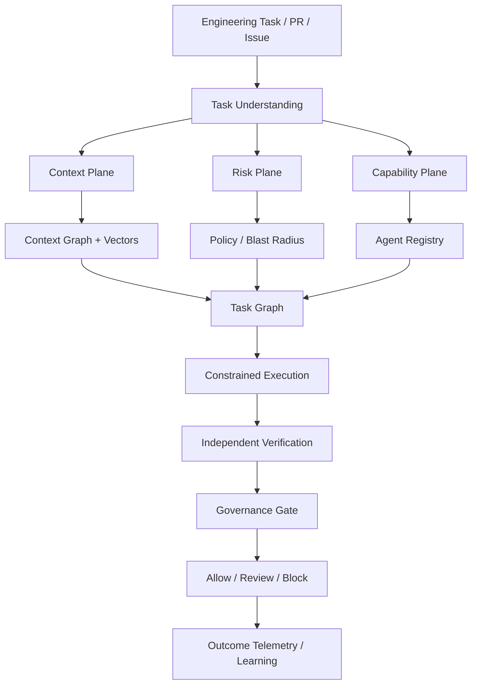

# Engram — Engineering Context, Routing & Safety Layer

### Context-aware control plane for AI-assisted software engineering

> **Canonical direction:** [`website/product-direction.md`](./website/product-direction.md)  
> This README distinguishes **implemented (alpha) / building / vision**. Do not treat the full control-plane story as production SaaS.

### Live demo

- **Try (hosted API):** [https://engram-cjph.onrender.com/try](https://engram-cjph.onrender.com/try) — prefer `/try`, not `/site/try.html`
- **Script:** public GitHub ingest → query / preflight → sample Auth run → reject → run again (prior)
- **Scope:** public demo only — no BYO clone/run, no merge/push, not multi-tenant SaaS  
  Details: [`docs/HOSTED_TRY.md`](./docs/HOSTED_TRY.md)

---

## Overview

**Engram** is an engineering context and safety system for AI-assisted software development.

It builds a structured model of a software organization across source code, services, pull requests, incidents, architectural decisions, documentation, ownership, and operational history—then uses that model to determine:

1. **What context** an AI agent needs for a task  
2. **Which agent / model / tools** should perform the work  
3. **What verification** is required before a change can proceed  

### Core principle

> AI engineering agents should not operate only on the code they can see.  
> They should operate within the technical history, constraints, ownership boundaries, and risk model of the system they are changing.

Rather than treating engineering knowledge as passive documentation—or retrieving the same context for every request—Engram constructs **task-specific context** and **execution policies**.

### Thesis (2026)

```text
Engineering intent
  → task-specific context
  → risk-aware routing
  → controlled agent execution
  → independent verification
  → organizational learning
```

The knowledge graph, Neo4j, Qdrant, and provenance remain foundational—but they are the **substrate**, not the whole product.

---

## What Engram is (and is not)

| Engram is | Engram is not |
|---|---|
| Context, routing & safety layer **around** coding agents | Another coding agent / Copilot replacement |
| Risk-aware context + capability + verification control | “OpenRouter, but for coding agents” |
| Evidence-linked, policy-constrained execution | Unrestricted multi-agent autonomy |
| Empirical learning from engineering outcomes (log now; policies later) | Pure RAG over docs |

**Moat thesis:** risk-aware, outcome-learning context and capability routing for engineering agents—not multi-agent orchestration alone, not graphs alone, not vectors alone.

---

## Six planes (system model)

| Plane | Question |
|---|---|
| **Context** | What does this organization know about this task? |
| **Routing** | Which context, agent, tools, and model should handle it? |
| **Execution** | How should the work be decomposed and performed? |
| **Verification** | Is the proposed change correct and safe? |
| **Governance** | Can this happen automatically, or does a human approve? |
| **Learning** | What did the outcome teach Engram about future tasks? |

---

## Three connected graphs

```text
ENGINEERING CONTEXT GRAPH     What does the system know?
  Services, code, PRs, incidents, ADRs, docs, ownership, deps, history

TASK / WORK GRAPH             What needs to happen?
  Objectives, subtasks, dependencies, constraints, evidence, risk

AGENT / CAPABILITY GRAPH      Who or what should perform it?
  Skills, models, tools, permissions, cost, latency, reliability
```

Together these let Engram reason about **relevant information** and **how work should be performed safely**.

---

## Three routing problems

### Context routing
Which engineering knowledge enters an agent’s working context for *this* task?  
A DB migration may need schema history + related incidents; a UI copy change may need almost none.

### Capability routing
Which agent, model, and tools fit the work—based on requirements, permissions, historical performance, cost, and latency?

### Risk routing
What verification path is required?  
Trivial docs → cheap single agent. Auth/payment/migrations → specialists + independent review + possible human gate.

**Principle:** use the **minimum agent organization** necessary to complete the task safely. The manager agent proposes; Engram supplies constraints (incidents, ADRs, ownership, policy)—the manager is not king.

---

## Controlled pipeline (vision)

```text
Engineering Task
      ↓
Task Understanding
      ↓
Context Routing
      ↓
Risk Analysis
      ↓
Capability / Agent Routing
      ↓
Task Decomposition (Task Graph)
      ↓
Agent Execution (constrained)
      ↓
Independent Verification (separation of duties)
      ↓
Governance Gate  →  Allow / Review / Block
      ↓
Outcome + Learning
```

---

## Status: what exists vs what is next

| Stage | Focus | Status |
|---|---|---|
| **V1 — Context Engine** | Neo4j + Qdrant + provenance; sample ingestion; preflight packet | **Implemented (V1 alpha)** |
| **V1.5 — Context Router** | Task-adaptive context selection + eval harness | **Implemented (V1.5 alpha)** |
| **V2 — Agent Router** | Small: Manager + Backend + Reviewer; git worktrees | **Implemented (V2 alpha)** |
| **V2.5 — Risk Router** | Blast-radius → review configuration (rules first) | **Implemented (V2.5 alpha)** |
| **V3 — Learning Layer** | Outcome telemetry → better routing policies | **Implemented (V3 alpha log + similar-task lookup)** |

### V1–V3 (current build) delivers

- Structured engineering context graph + semantic retrieval  
- GitHub pull-request ingest (additive; sample org still required for the auth demo)  
- Evidence / provenance for retrieved claims  
- Preflight-style context packets for proposed changes  
- Task-adaptive context routing + eval harness (recall, waste, tokens, citation groundedness)  
- Thin agent router: Manager proposes, Engram constrains, Backend edits a git worktree, Reviewer is read-only  
- Deterministic risk router: blast radius → org; ADR cap violations → `block` + human required  
- Outcome log: each run is recorded; a human can approve/reject without merging; similar resolved outcomes are injected as constraints (lookup, not a trained policy)  

### Not claimed as shipped

- Merge / deploy / push of agent candidates  
- Human approval inbox / CI governance runtime  
- Learned routing policies from production outcomes  
- Full multi-agent “AI office”  
- Enterprise-wide agent registry at scale

---

## Architecture (V1 substrate)

```text
Data Sources → Ingestion → Extraction
        ↓
   Graph DB (Neo4j)  +  Vector DB (Qdrant)
        ↓
   Semantic / Provenance Layer
        ↓
   Hybrid Query Engine
        ↓
   Orchestration (LangGraph) → API (FastAPI)
```

### Product flow (toward vision)



### Example entities & relationships (context graph)

```text
PR → AFFECTS → Service
Incident → RELATED_TO → PR
ADR → GOVERNS → Service
Service → DEPENDS_ON → Service
```

---

## Tech stack

- Python + FastAPI  
- Neo4j (context graph)  
- Qdrant (semantic retrieval)  
- LangGraph (orchestration)  
- OpenAI / Anthropic (reasoning / agents)  

---

## Research program (aligned with product)

1. Task-adaptive context routing under fixed token budgets  
2. Does historical engineering context improve risk-sensitive agent changes?  
3. Capability-aware routing for heterogeneous SE agents  
4. Risk-adaptive verification for autonomous software changes  
5. Learning context and agent selection policies from outcomes  

Dogfood: use Engram while building other products (e.g. Havenly)—Engram stays general infrastructure; the product org is a test tenant, not a feature embed.

---

## Design decisions

- **Structure before cleverness** — LLMs reason over grounded context; they are not the long-term memory  
- **Provenance required** for risk claims — no unsupported “safe to merge” theater  
- **Separation of duties** — implementer ≠ sole verifier  
- **Minimum agency** — instantiate only as much agent organization as risk justifies  
- **Eval harness early** — especially for context routing (V1.5)  
- **Havenly as dogfood**, not as Engram’s product surface (until Havenly has eng history, use BYO GitHub + sample Auth)  

---

## Running locally (V1–V3 alpha)

Versioned guides: [`docs/V1.md`](./docs/V1.md) · [`docs/V1.5.md`](./docs/V1.5.md) · [`docs/V2.md`](./docs/V2.md) · [`docs/V2.5.md`](./docs/V2.5.md) · [`docs/V3.md`](./docs/V3.md) · [`docs/HOSTED_TRY.md`](./docs/HOSTED_TRY.md)

```bash
cp .env.example .env
python3 -m venv .venv && source .venv/bin/activate
pip install -r requirements.txt
python main.py seed
python main.py ingest-github --repo anthropics/claude-cookbooks --limit 30
python main.py serve
# open http://127.0.0.1:8000/try
pytest
python main.py eval
python main.py run
python main.py resolve --last --decision rejected --note "ADR-12 stands"
python main.py run
```

Docker is optional. Default `ENGRAM_STORE=local` uses a file-backed graph + embedded Qdrant. For Neo4j + Qdrant containers:

```bash
# .env: ENGRAM_STORE=docker
docker compose up -d
python main.py seed
```

Preflight / agent demo:

```bash
python main.py preflight \
  --service "Auth Service" \
  --task "Increase auth session TTL from 24 hours to 7 days"

python main.py run \
  --service "Auth Service" \
  --task "Increase auth session TTL from 24 hours to 7 days"
```

API docs: `http://127.0.0.1:8000/docs` · Try UI: `http://127.0.0.1:8000/try` · Meta: `GET /meta`

---

## Project structure

```text
engram/
├── api/           FastAPI (+ public-mode guards, /try static mount)
├── agents/        Thin V2: Manager / Backend worktree / Reviewer
├── graph/         Neo4j or local file graph
├── vector/        Qdrant (server or embedded) + embeddings
├── ingestion/     Sample org seed + GitHub PR/commit ingest
├── retrieval/     Hybrid graph + vector retrieval
├── routing/       V1.5 context router + V2.5 risk router
├── learning/      V3 outcome log + similar-task lookup
├── preflight/     Risk rules + packet assembly
├── provenance/    Evidence helpers
├── eval/          Retrieval eval harness
├── engine.py      LangGraph preflight + agent run
├── config.py
└── models/
data/sample/       Demo org + sandbox fixtures
data/evals/        V1.5 eval cases
website/           Marketing (Vercel) + Try UI (served by API)
docs/              V1–V3 + HOSTED_TRY
Dockerfile         Render / container deploy
render.yaml        Hosted Try starting point
```

---

## Positioning

Coding agents **perform** work.

Engram determines:

- What do they need to know?  
- Who should perform the task?  
- What are they allowed to do?  
- What could go wrong?  
- Who or what must verify it?  
- What did the organization learn from the result?  

**Long-term goal:** make increasingly autonomous software engineering possible **without** separating AI execution from organizational context, technical history, provenance, and human governance.

---

## Docs

| Doc | Role |
|---|---|
| [`docs/HOSTED_TRY.md`](./docs/HOSTED_TRY.md) | Hosted Try deploy, public scope, demo script |
| [`docs/V1.md`](./docs/V1.md) … [`docs/V3.md`](./docs/V3.md) | Versioned build notes |
| [`website/product-direction.md`](./website/product-direction.md) | Canonical product strategy (2026) |
| [`product-vision.md`](./product-vision.md) | Product vision (aligned; see update banner) |
| [`AGENTS.md`](./AGENTS.md) | Non-negotiables for contributors / coding agents |
| [`website/`](./website/) | Marketing site + Try UI |
